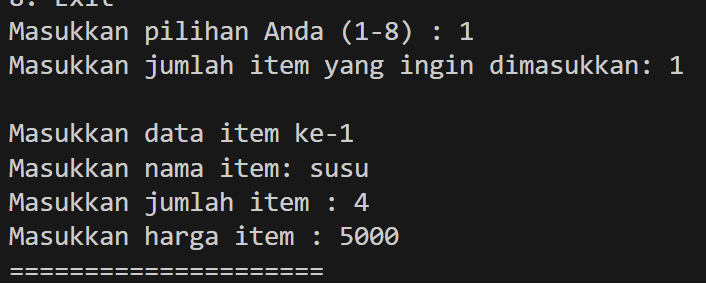
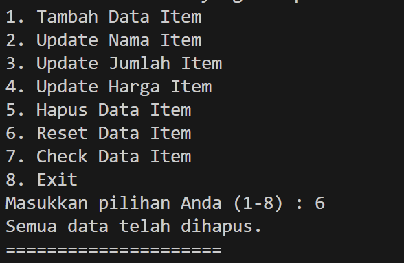

# LAPORAN KUIS 1 ASD
NIM : 2241760119

NAMA : MARITZA ULFA HURIYAH

KELAS : SIB 2C

## Nomor 1

Kode diatas dilakukan agar bisa memanggil method di class lain. 

## Nomor 2

Kode diatas untuk bisa menambahkan nama item, jumlah item, dan harga item. kodenya mengggunakan Scanner agar dapat diinputkan sesuai dengan yang diinginkan

## Nomor 3

Kode diatas bermaksud agar bisa mengganti nama yang awalnya diinputkan oleh user. 

output diatas menunjukkan bahwa jumlah item sudah bisa diganti

output diatas menunjukkan bahwa harga item sudah diganti

## Nomor 4

kode diatas untuk bisa menghapus sesuai dengan nama item yang diingin kan user. hal itu menggunakan perulangan agar bisa menghapus data dan tidak cuma 1

Output diatas menunjukkan bahwa user telah berhasil mereset data. Hal itu karen di kode nya diubah menjadi 0 dan Null.

## Nomor 5

Output yang keluar menampilkan data item yang sudah dimasukkan

## Nomor 6

Kode diatas membuat percabangan yang akan membuat harga total di kurangi dengan harga diskonnya

## FLOWCHART

