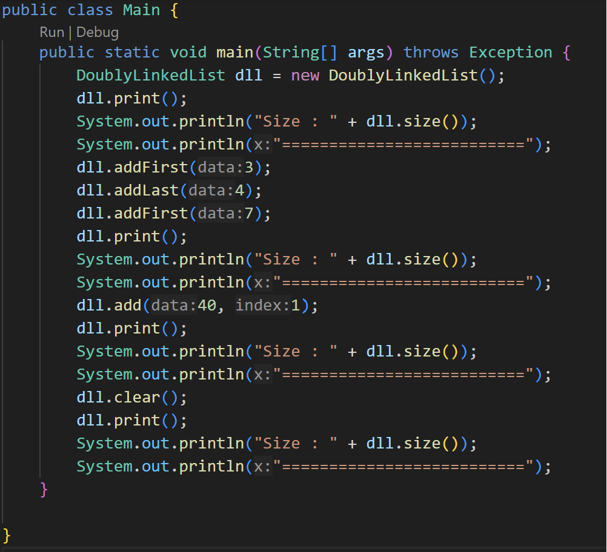
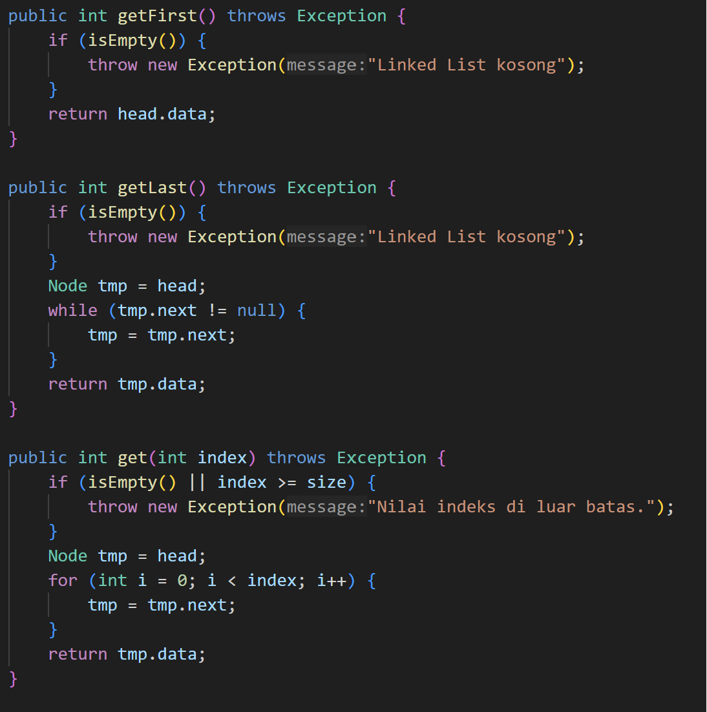
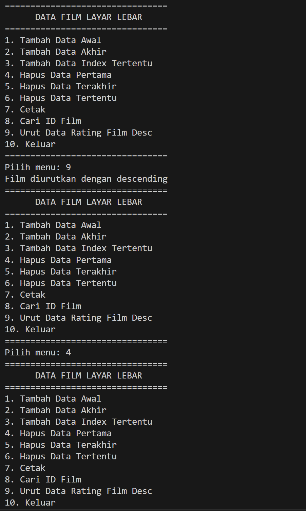

# Laporan Pertemuan 9
NIM : 2241760119

NAMA : MARITZA ULFA HURIYAH

KELAS : SIB 2C

## Praktikum 1
### Kode:
kelas Node:

Kelas DoublyLinkedList:

Kelas Main:

Output:

### Pertanyaan
1. Single Linked List: setiap node dalam single linked list hanya memiliki satu pointer, traversal dalam single linked list hanya dapat dilakukan dalam satu arah, yaitu dari awal ke akhir.
Doubly Linked List: setiap node dalam doubly linked list memiliki dua pointer, Traversal dalam doubly linked list dapat dilakukan dalam dua arah, yaitu dari awal ke akhir dan sebaliknya.

2. Atribut next dan prev pada class Node digunakan dalam implementasi doubly linked list.

3. Atribut head pada class Doubly Linked List digunakan untuk menyimpan referensi ke node pertama dalam linked list, sedangkan atribut size digunakan untuk menyimpan jumlah node dalam linked list. 

4. Dalam method addFirst(), pembuatan objek dari konstruktor class Node dengan prev dianggap sama dengan null karena prev adalah pointer yang menunjuk ke node sebelumnya dalam linked list.

5. Pada method addFirst(), statement head.prev = newNode digunakan untuk mengatur pointer prev dari node pertama dalam linked list.

6. Pada method addLast(), pembuatan objek Node dengan mengisikan parameter prev dengan current dan next dengan null digunakan untuk menambahkan node baru di akhir linked list.

7. Pada method add(), terdapat potongan kode program sebagai berikut,
if (current.prev == null) {
    Node newNode = new Node(null, data, current);
    current.prev = newNode;
    head = newNode;
}
digunakan untuk menambahkan node baru di awal linked list ketika linked list kosong atau ketika node baru harus ditambahkan sebelum node pertama dalam linked list. Pada potongan kode program tersebut.

## Praktikum 2

### Kode:
kelas Node:

Kelas DoublyLinkedList:

Kelas Main:

Output:

### Pertanyaan
1. Kode head = head.next;, maksudnya adalah mengatur head baru untuk menunjuk ke elemen berikutnya dalam linked list. Dalam implementasi doubly linked list, setiap node memiliki referensi ke node sebelumnya dan node berikutnya. Dan kode head.prev = null;, maksudnya adalah mengatur referensi prev dari elemen baru yang menjadi head menjadi null. Dalam implementasi doubly linked list, setiap node memiliki referensi ke node sebelumnya dan node berikutnya. Dengan mengatur prev dari elemen baru menjadi null, kita memastikan bahwa tidak ada koneksi yang tersisa antara elemen pertama yang baru dan elemen sebelumnya

2. cara mendeteksi posisi data yang ada pada bagian akhir yaitu iterasi melalui Linked List hingga mencapai elemen sebelum elemen terakhir. hal itu dapat dilakukan dengan menggunakan variabel current yang awalnya diatur sebagai head dan menggerakkannya ke elemen berikutnya pada setiap iterasi.

3. Karena kode tersebut tidak memeriksa apakah node yang dihapus adalah node yang diinginkan atau tidak, dan tidak memeriksa apakah node yang dihapus adalah node terakhir dalam linked list.

4. Kode current.prev.next = current.next; mengatur pointer next dari node sebelum current untuk menunjuk ke node setelah current, mengabaikan current. Sedangkan kode current.next.prev = current.prev; mengatur pointer prev dari node setelah current untuk menunjuk ke node sebelum current, mengabaikan current.

## Praktikum 3

### Kode:
kelas Node:

Kelas DoublyLinkedList:

Kelas Main:

Output:

### Pertanyaan
1. Metode size() di class DoublyLinkedList akan mengembalikan jumlah elemen yang saat ini ada dalam linked list ganda sesuai dengan nilai yang disimpan dalam variabel size

2. Untuk mengatur indeks pada doubly linked list agar dimulai dari indeks ke-1, bisa menambahkan sebuah field baru bernama index pada class Node untuk menyimpan indeks dari setiap node.

3. Kalau Add di single linked list hanya memiliki 1 variabel pointer yang menunjuk ke node selanjutnya. Dan ketika menambahkan node baru pada single linked list, kita hanya perlu mengubah pointer dari node sebelumnya untuk menunjuk ke node baru, dan mengubah pointer dari node baru untuk menunjuk ke node selanjutnya. selain itu operasi add pada single linked list hanya dapat dilakukan pada bagian akhir dari linked list.
Sedangkan doubly linked list memiliki dua variabel pointer. Dan ketika menambahkan node baru pada doubly linked list, kita perlu mengubah pointer dari node sebelumnya untuk menunjuk ke node baru, mengubah pointer dari node baru untuk menunjuk ke node selanjutnya, dan mengubah pointer dari node selanjutnya untuk menunjuk kembali ke node baru. Lalu Operasi add pada doubly linked list dapat dilakukan pada bagian awal atau akhir dari linked list.

4. Kode 1 menggunakan logika untuk memeriksa size dari struktur datanya sama dengan 0, dan akan mengembalikan nilai true jika benar. namun jika ukuran bukan 0 maka kode mengembalikan nilai flase.
Kode 2 memeriksa apakah variabel head memiliki nilai null atau tidak. jika head berniali null maka kode akan mengembalikan nilai trus, namun jika tidak bernilai null maka kode akan mengembalikan nilai false.

## TUGAS
1. Output:

2. Output:

