# Laporan Pertemuan 11
NIM : 2241760119

NAMA : MARITZA ULFA HURIYAH

KELAS : SIB 2C

## Praktikum 1
### Kode:
Kelas Node

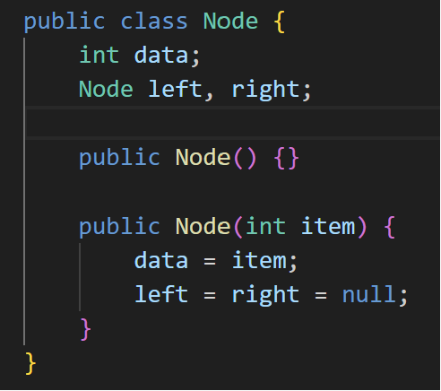

Kelas BinaryTree

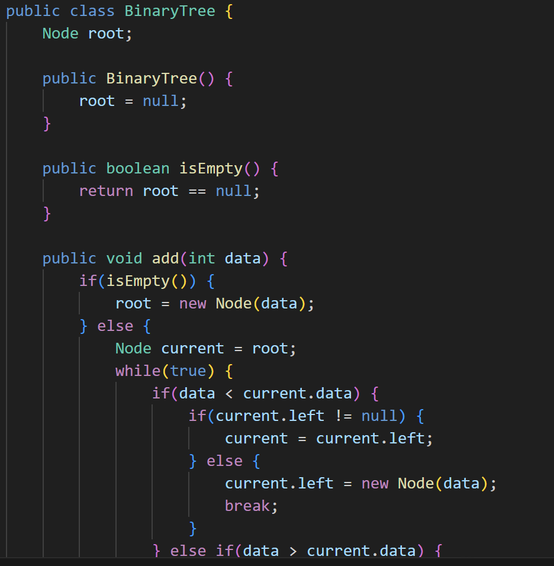

Kelas BinaryTreeMain

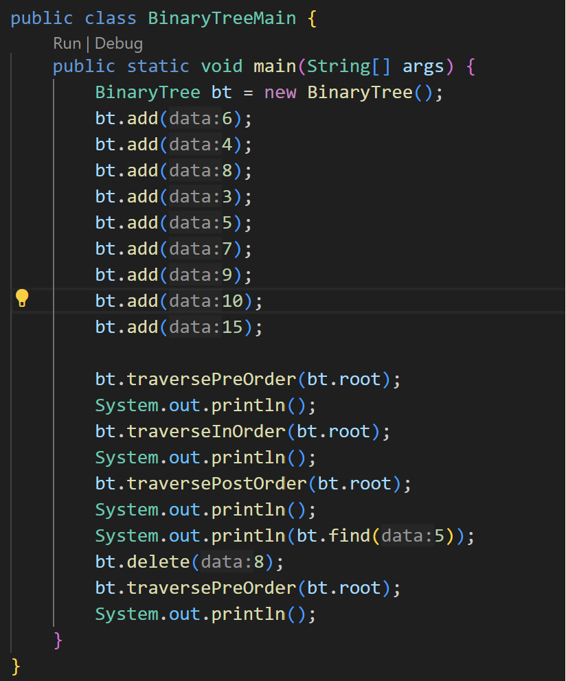

Output:

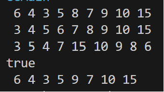

### Pertanyaan:
1. karena binary search tree(BST) memiliki data yang unik dan terurut. dalam BST subpohon kiri hanya berisi angka yang lebih kecil daripada node tersebut. dan subpohon kanan dari node hanya berisi node-node dengan data yang lebih besar.
2. Attribut left pada class node digunakan untuk menyimpan referensi ke node anak kiri, dan Anda dapat mengakses atau mengubah node anak kiri dengan mengacu ke atribut itu. sedangkan atribut right digunakan untuk menyimpan referensi ke node anak kanan, dan Anda dapat mengakses atau mengubah node anak kanan.
3. Atribut root dalam class BinaryTree digunakan untuk menyimpan referensi ke root node dari pohon biner. Dan ketika objek tree pertama kali dibuat nilai dari root adalah null. 
4. Ketika tree masih kosong dan ditambahkan node baru, nilai root akan diperbarui menjadi nilai node tersebut.
5. if(data < current.data) => kondisi yang memeriksa apa nilai data yang akan ditambahkan lebih kecil daripada nilai data dari node current atau tidak. Jika benar, itu berarti kita harus mencari tempat untuk menambahkan node baru ke anak kiri dari current.
if(current.left != null) => Kondisi ini memeriksa apakah current sudah memiliki anak kiri atau belum. Jika current sudah memiliki anak kiri, maka berdasafkan kode tersebut bergerak lebih dalam ke pohon dan memeriksa anak kiri current sebagai node current.
current = current.left; => Jika current memiliki anak kiri, maka current dirubah menjadi anak kiri tersebut, sehingga dilanjutkan pencarian untuk menemukan posisi yang tepat untuk menambahkan node baru.
else
current.left = new Node(data); => Jika current tidak memiliki anak kiri (yaitu, current.left adalah null), itu berarti telah ditemukan tempat yang sesuai untuk menambahkan node baru. Pada titik ini, node baru akan dibuat dengan nilai data dan menghubungkannya sebagai anak kiri dari current.

## Praktikum 2
### Kode:
Kelas Node

Kelas BinaryTreeArray

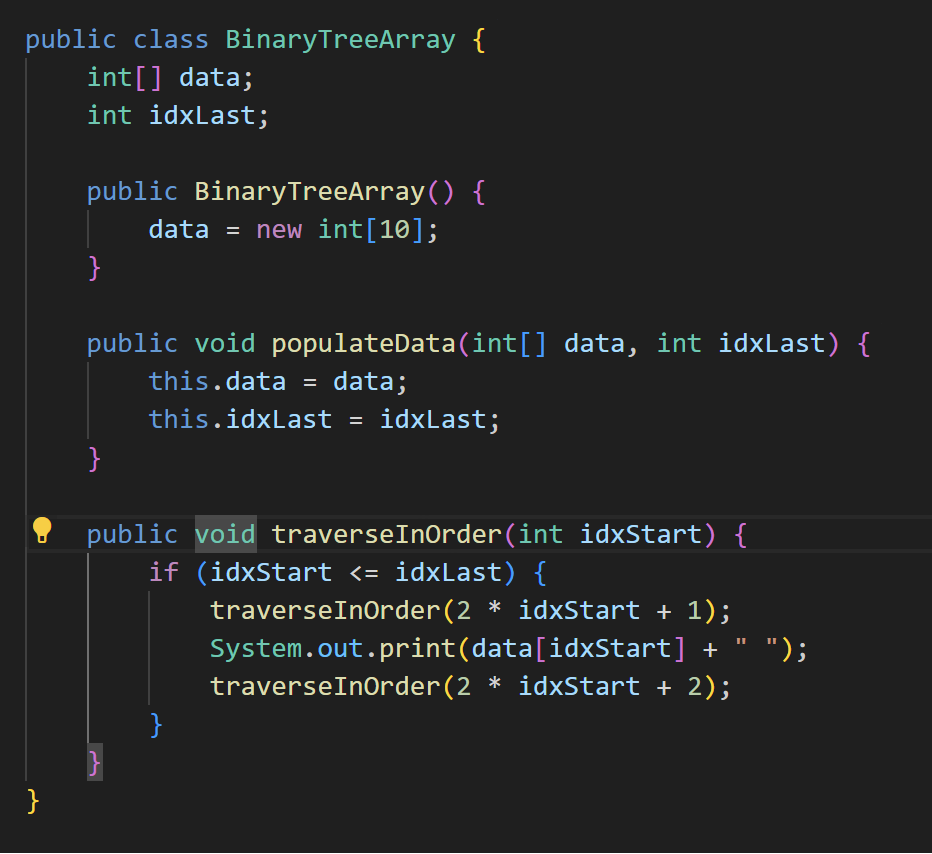

Kelas BinaryTreeArrayMain

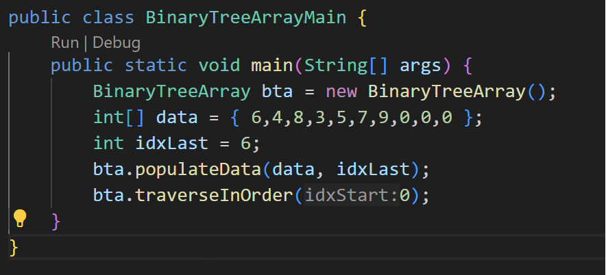

Output:

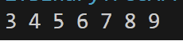

### Pertanyaan:
1. data pada class BinaryTreeArray digunakan untuk menyimpan data dari setiap node di pohon biner. sedangkan idxlast digunakan dalam array data untuk mengindikasikan indeks terakhir saat membangun pohon biner.
2. method populateData() berfungsi untuk menginisialisasi atau memasukkan data ke dalam struktur pohon biner dalam bentuk array. Metode ini juga bisa mengatur data yang akan digunakan untuk membangun pohon biner yang direpresentasikan dalam array.
3. method traverseInOrder() berfungsi untuk ntuk melakukan penelusuran (traversal) pada pohon biner yang direpresentasikan dalam bentuk array secara in-order. metode traverseInOrder() juga akan mencetak nilai-nilai node dalam pohon biner dalam urutan yang benar sesuai aturan penelusuran in-order.
4. Left child akan ada pada indeks 2 * 2 + 1 = 5
Right child akan ada pada indeks 2 * 2 + 2 = 6
5. idxLast=6, ini berarti mengindikasikan bahwa array digunakan untuk merepresentasikan pohon biner yang memiliki elemen hingga pada indeks 6 dalam array. array ini digunakan untuk merepresentasikan pohon biner yang memiliki 7 elemen (indeks 0 hingga 6) termasuk akar dan semua anak-anaknya.

## TUGAS
1. Output:

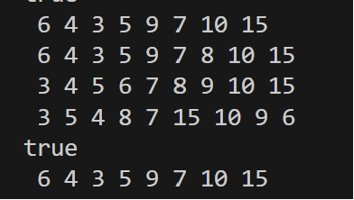

Kelas Main:
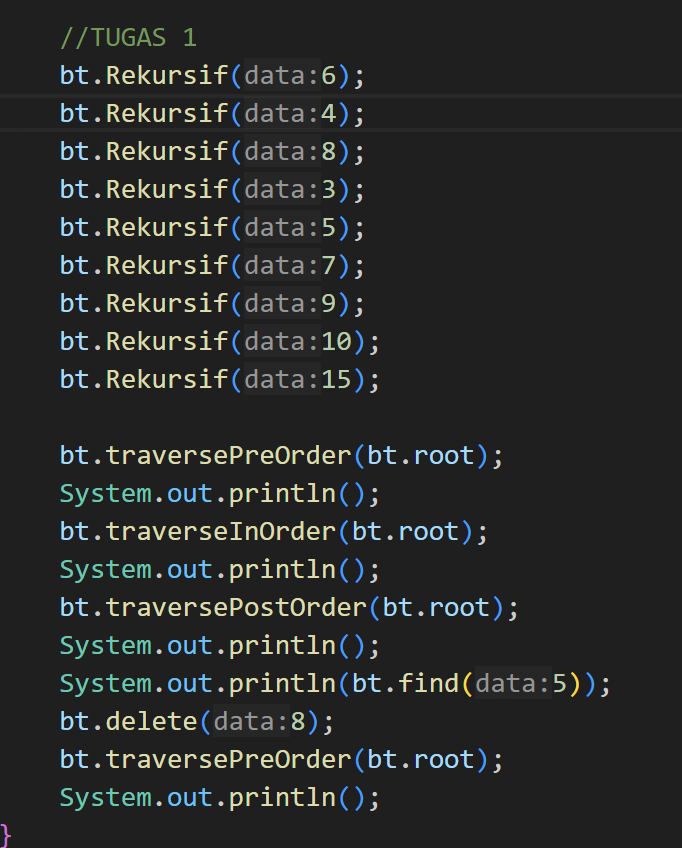

Kelas BT
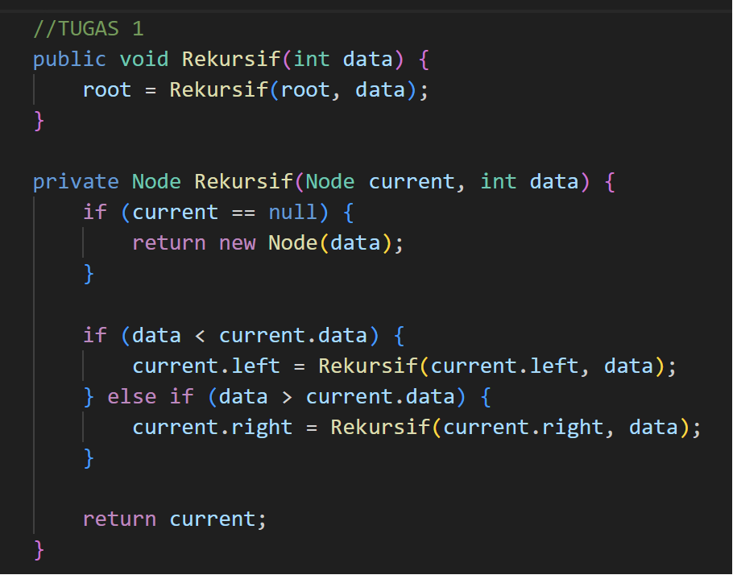

2. Output: 

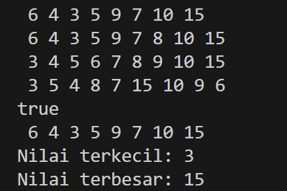

Kelas Main:
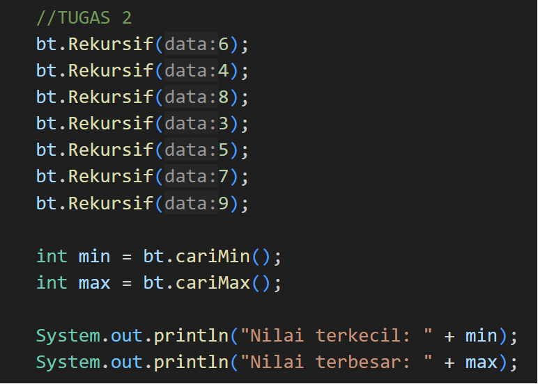

Kelas BT
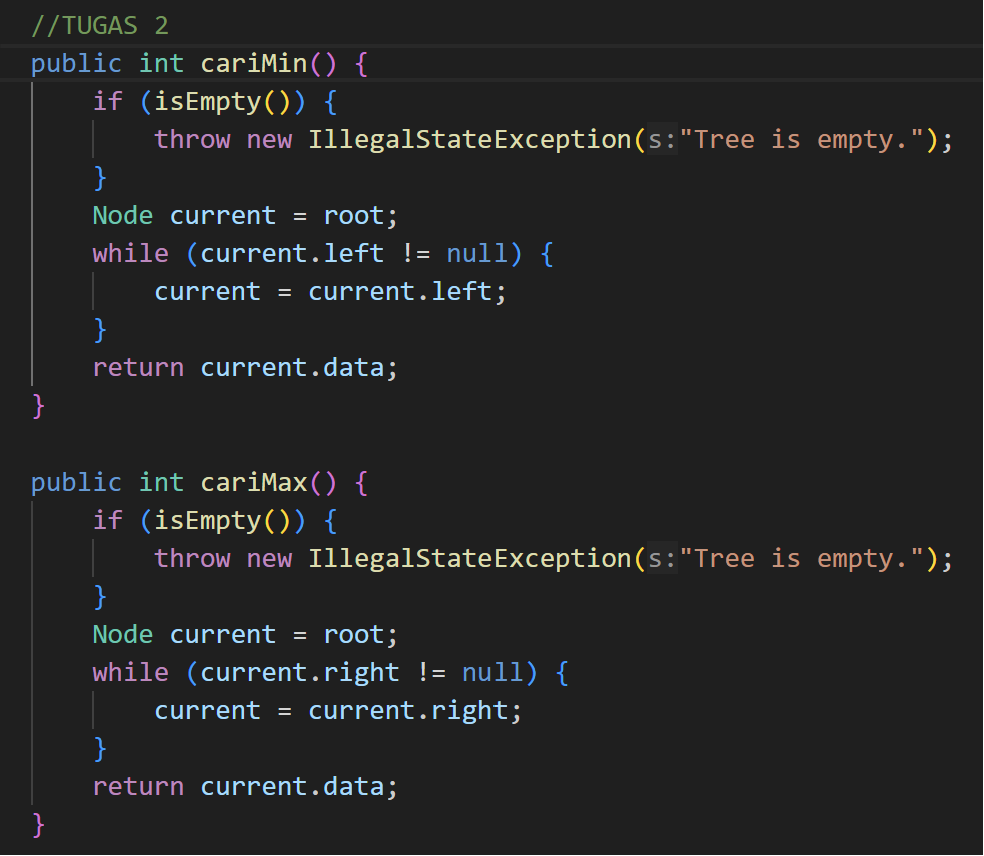

3. Output: 

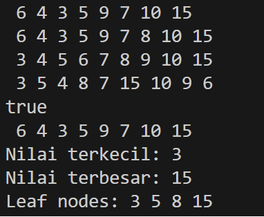

Kelas Main:
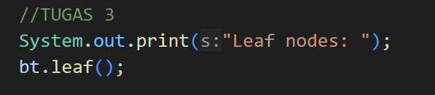

Kelas BT
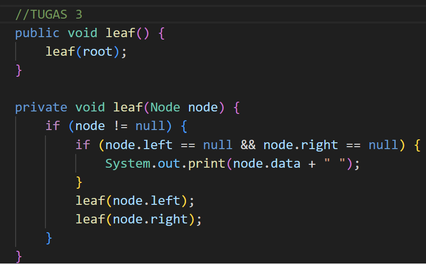

4. Output: 

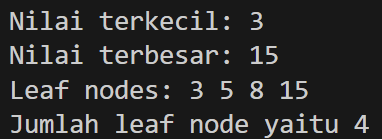

Kelas Main:
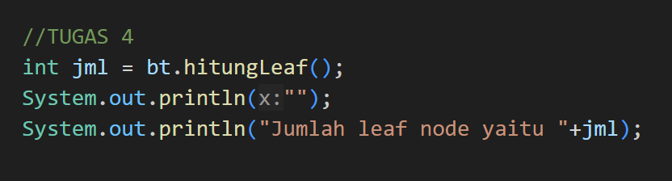

Kelas BT
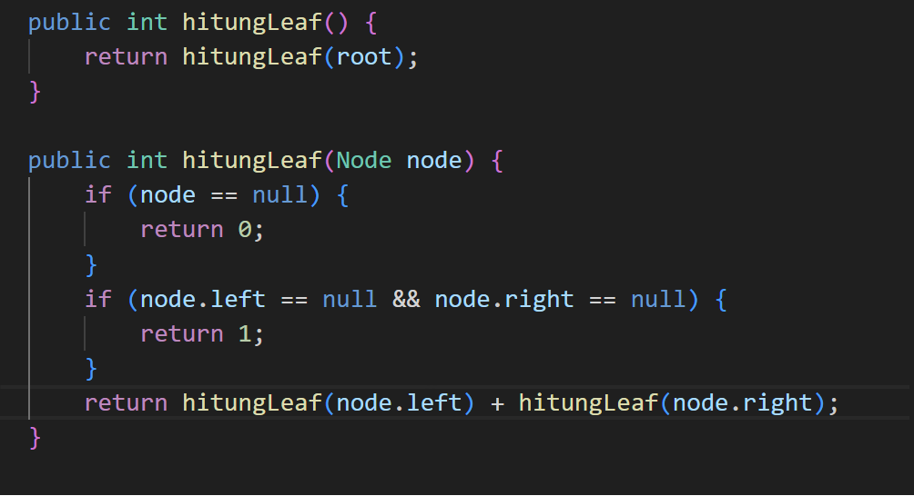

5. Output: 
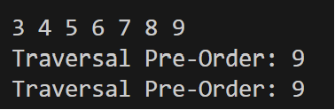

Kelas Main:
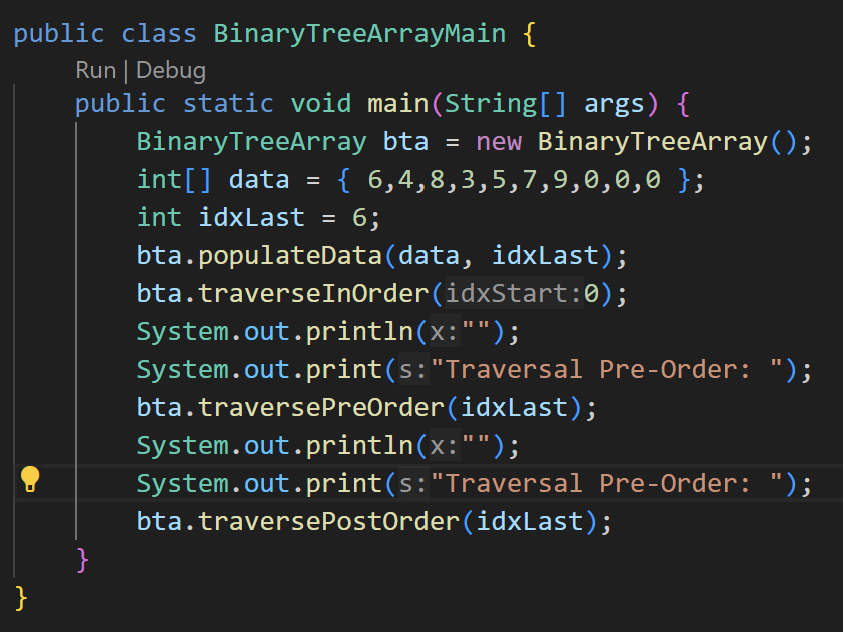

Kelas BT
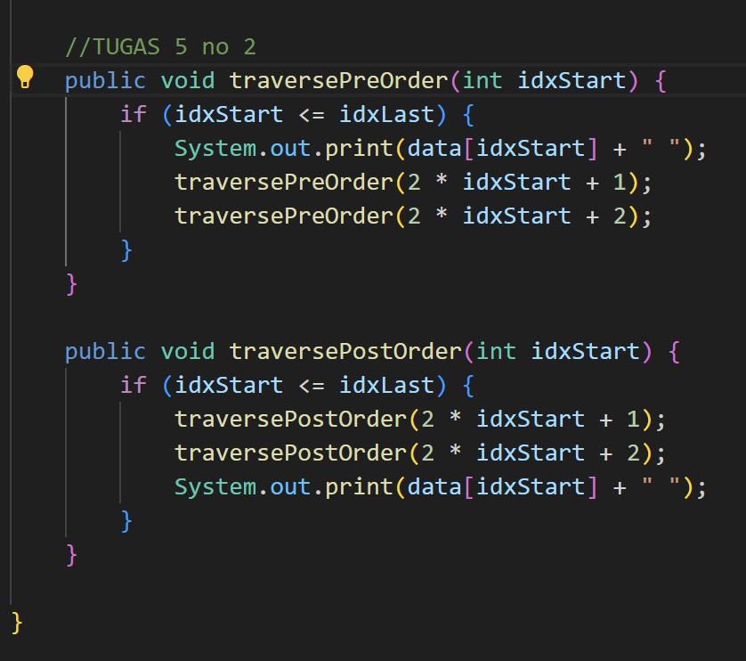
