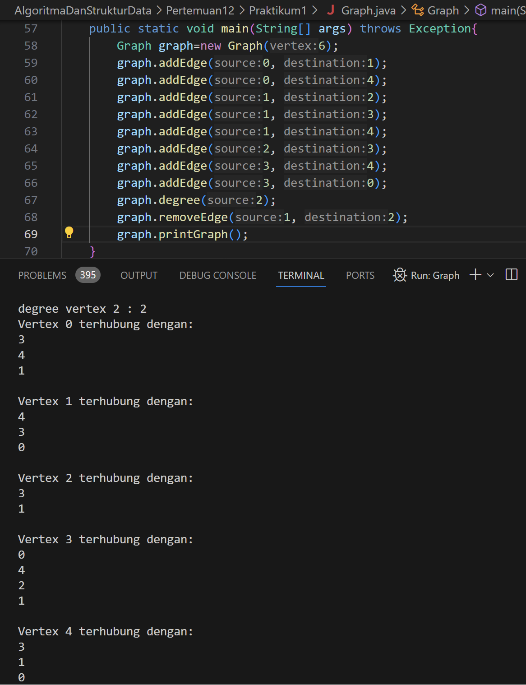
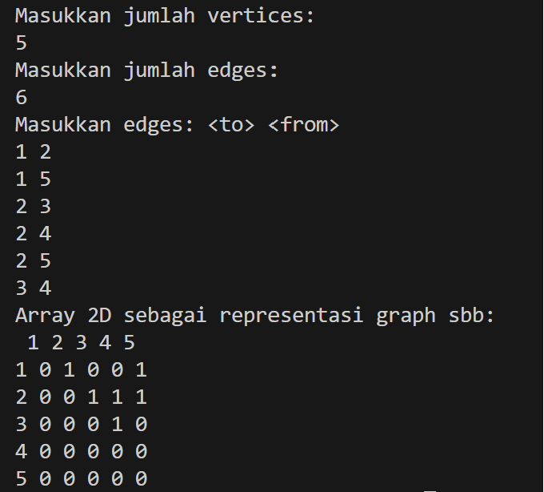

# Laporan Pertemuan 12
NIM : 2241760119

NAMA : MARITZA ULFA HURIYAH

KELAS : SIB 2C

## Praktikum 1
### Output Praktikum:

### Pertanyaan:
1. Sebutkan beberapa jenis (minimal 3) algoritma yang menggunakan dasar Graph, dan apakah kegunaan algoritma-algoritma tersebut? 
   
        Algoritma Breadth First (BFS): untuk mencari informasi pada struktur  data graf, dan untuk mencari jalur terpendek antara 2 node dalam graf.
         Algoritma Depth First Search: digunakan untuk menjelajahi sejauh mungkin mungkin ke dalam suatu cabang sebelum mundur dan menjelajah cabang lain.
         Algoritma Djikstra: untuk menemukan jalur terpendek dari satu simpul ke semua simpul lainnya dalam graf berbobot positif.

2. Pada class Graph terdapat array bertipe LinkedList, yaitu LinkedList list[]. Apakah tujuan pembuatan variabel tersebut ? 
    
        Variabel LinkedList list[] pada class Graph digunakan untuk merepresentasikan graf dengan cara menyimpan daftar simpul tetangga dari setiap simpul pada graf.

3. Apakah alasan pemanggilan method addFirst() untuk menambahkan data, bukan method add 
jenis lain pada linked list ketika digunakan pada method addEdge pada class Graph?
    
        Pemanggilan method addFirst() digunakan untuk menambahkan data ke awal linked list, bukan method add jenis lain, karena addFirst() secara khusus dirancang untuk menambahkan elemen ke awal linked list. Ketika digunakan pada method addEdge pada class Graph, addFirst() digunakan untuk menambahkan node ke awal linked list yang merepresentasikan node pada graf. 

4. Bagaimana cara mendeteksi prev pointer pada saat akan melakukan penghapusan suatu edge pada graph ?
    
        Untuk melakukan penghapusan suatu edge pada graph, perlu dicari node yang akan dihapus dari daftar node asal. pointer prev akan menunjuk pada node sebelum node yang akan dihapus, sehingga dapat mengubah pointer next pada node sebelum node yang akan dihapus untuk menghapus node tersebut dari linked list.

5. Kenapa pada praktikum 12.2 langkah ke-12 untuk menghapus path yang bukan merupakan lintasan pertama kali menghasilkan output yang salah ? Bagaimana solusinya ?

        Output yang dikeluarkan tidak error namun data vertex yang dilewati mengalami perubahan path atau lintasan.

## Praktikum 2
### Output Praktikum:

### Pertanyaan:
1. Apakah perbedaan degree/derajat pada directed dan undirected graph? 

        Undirected graph: degree dari suatu node adalah jumlah edge yang terhubung ke node tersebut. Dan setiap edge tidak memiliki arah. 
   
        Directed Graph: terdapat konsep in-degree dan out-degree. In-degree dari suatu node adalah jumlah edge yang menuju ke node tersebut, sedangkan out-degree adalah jumlah edge yang keluar dari node tersebut. Dan setiap edge memiliki arah.

2. Pada implementasi graph menggunakan adjacency matriks. Kenapa jumlah vertices harus ditambahkan dengan 1 pada indeks array berikut?

        Agar jika terdapat n vertices, indeks array akan berjalan dari 0 hingga n-1. Oleh karena itu, untuk merepresentasikan n vertices, perlu mengalokasikan array dengan ukuran n+1 agar dapat menampung semua vertices yang dimulai dari indeks 1 hingga n. 

3. Apakah kegunaan method getEdge() ? 
        
         Method getEdge() pada graph digunakan untuk mendapatkan edge yang menghubungkan dua buah node pada graph.

4. Termasuk jenis graph apakah uji coba pada praktikum 12.3 ?   

        Graf dari praktikum 12.3 adalah undirected graph.

5. Mengapa pada method main harus menggunakan try-catch Exception ?
    
        try cacth digunakan untuk menangani kemungkinan exception yang mungkin terjadi saat eksekusi program.

## Tugas
1. Output:

2. Output:

3. Output:

4.      Output clas Graph:

        Output class GraphArray:
