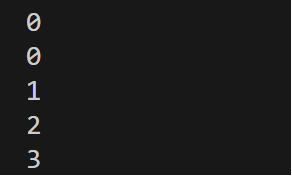

# Laporan Pertemuan 14
NIM : 2241760119

NAMA : MARITZA ULFA HURIYAH

KELAS : SIB 2C

## PRAKTIKUM
### Percobaan
- Kode class HashTable

        package AlgoritmaDanStrukturData Pertemuan14.Praktikum;

        import java.util.ArrayList;

        public class HashTable {
            private int size = 7;
            private Node[] dataMap;
            class Node {
                String key;
                int value;
                Node next;
                
            Node(String key, int value) {
                this.key = key;
                this.value = value;
            }
        }

        public HashTable() {
            this.dataMap = new Node[this.size];
        }

        public void printTable() {
            for (int i = 0; i < this.dataMap.length; i++) {
                System.out.println(i + ":");
                Node current = this.dataMap[i];
                while (current != null) {
                    System.out.println("Key: " + current.key + ", Value: " + current.value);
                    current = current.next;
                    
                }
            }
        }

        public int hash(String key) {
            int hash = 0;
            for (int i = 0; i < key.length(); i++) {
                hash = (hash + key.charAt(i) * i) % this.dataMap.length;
            }
            return hash;
        }

        public void set(String key, int value) {
            int hash = this.hash(key);
            Node newNode = new Node(key, value);
            if (this.dataMap[hash] == null) {
                this.dataMap[hash] = newNode;
            } else {
                Node current = this.dataMap[hash];
                if(current.key == key) {
                    current.value += value;
                    return;
                }
                while (current.next != null) {
                    current = current.next;
                    if(current.key == key) {
                        current.value += value;
                        return;
                    }
                }
                current.next = newNode;
            }
        }

        public int get(String key) {
            int hash = this.hash(key);
            Node current = this.dataMap[hash];
            while (current != null) {
                if (current.key == key) return current.value;
                current = current.next;
            }
            return 0;
        }

        public ArrayList keys() {
        ArrayList<String> keys = new ArrayList<>();
        for (int i = 0; i < this.dataMap.length; i++) {
            Node current = this.dataMap[i];
            while (current != null) {
                keys.add(current.key);
                current = current.next;
            }
        }
        return keys;
        }
        }

- Kode class HashTableMain

        package AlgoritmaDanStrukturData.Pertemuan14.Praktikum;

        public class HashTableMain {
            public static void main(String[] args) {
            HashTable table = new HashTable();

            System.out.println( table.hash("apple") );
            System.out.println( table.hash("banana") );
            System.out.println( table.hash("cherry") );
            System.out.println( table.hash("date") );
            System.out.println( table.hash("eggplant") );

            table.set("apple", 100);
            table.set("banana", 50);
            table.set("cherry", 300);
            table.set("date", 500);
            table.set("eggplant", 10);

            table.printTable();

            System.out.println("Apple:");
            System.out.println( table.get("apple") );

            System.out.println("\nDate:");
            System.out.println( table.get("date") );

            System.out.println( table.keys() );
            }   
        }

- Output

Output 1:

Output 2: 

Output 3:

Output 4:

### Pertanyaan
1. Apa keunggulan penanganan collision menggunakan metode separate chaining dibandingkan dengan motode linear probing?
    
         Separate chaining memiliki keunggulan dalam efisiensi penggunaan memori dan kesederhanaan implementasi. Separate chaining lebih sederhana dalam implementasinya, terutama dalam menangani elemen, sementara linear probing memiliki beberapa tantangan, seperti primary clustering dan kesulitan dalam mengelola penghapusan

2. Apa maksud dari potongan kode berikut pada method hash()?
int hash = 0;
for (int i = 0; i < key.length(); i++) {
    hash = (hash + key.charAt(i) * i) % this.dataMap.length;
}

        Setiap kunci akan diubah menjadi sebuah nilai hash yang akan menentukan posisi penyimpanannya di dalam tabel hash (this.dataMap)

3. Apa maksud dari potongan kode berikut pada method set()?
else {
    Node current = this.dataMap[hash];
    if(current.key == key) {
        current.value += value;
        return;
    }
    while (current.next != null) {
        current = current.next;
        if(current.key == key) {
            current.value += value;
            return;
        }
    }
    current.next = newNode;
}

        method ini dipanggil untuk menetapkan nilai (value) untuk suatu kunci (key) di dalam tabel hash, langkah-langkah tertentu dijalankan. program memeriksa apakah terdapat node dengan kunci yang sama pada indeks yang dihasilkan oleh fungsi hash. lalu setiap node dicek untuk memastikan bahwa tidak ada node dengan kunci yang sama. Proses ini memastikan bahwa kunci yang unik dapat disimpan dalam tabel hash, dan jika kunci tersebut sudah ada, nilai yang sesuai dapat diperbarui tanpa menambahkan duplikat node baru.

4. Buatlah method remove() untuk menghapus data berdasarkan key.

        - kode class HashTable:
            public void remove(String key) {
            int hash = this.hash(key);
            Node current = this.dataMap[hash];
            Node prev = null;  
                while (current != null && !current.key.equals(key)) {
                    prev = current;
                    current = current.next;
                }    
                if (current != null) {
                    if (prev == null) {
                        this.dataMap[hash] = current.next;
                    } else {
                        prev.next = current.next;
                    }
                }
            }

        - kode class HashTableMain:
            table.remove("banana");
            System.out.println(" ");
            System.out.println("Setelah menghapus 'banana':");
            table.printTable();

- output :

- 

## TUGAS
- Menu 1 (Tambah Data)

- Menu 4 (Tampil Data)

- Menu 2 (Cari Data Berdasarkan NIM)

- Menu 3 (Hapus Data Berdasarkan NIM)

