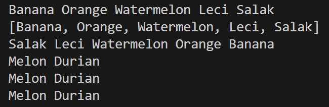
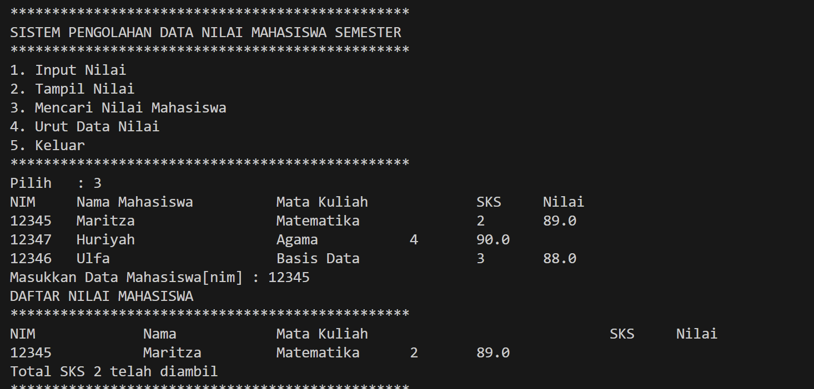

# Laporan Pertemuan 16
NIM : 2241760119

NAMA : MARITZA ULFA HURIYAH

KELAS : SIB 2C

## PRAKTIKUM 1
### Kode

### Output

### Pertanyaan
1.  List l = new ArrayList();
        l.add(1);
        l.add(2);
        l.add(3);
        l.add("Cireng");
        System.out.printf("Elemen 0 : %d total elemen : %d elemen terakhir : %s\n",l.get(0), l.size(), l.get(l.size()-1));
        l.add(4);
        l.remove(0);
        System.out.printf("Elemen 0 : %d total elemen : %d elemen terakhir : %s\n",l.get(0), l.size(), l.get(l.size()-1));
        
        Penjelasan: 
        ArrayList adalah bagian dari Java Collections Framework yang merupakan generic class, yang artinya bisa menyimpan elemen-elemen dari berbagai jenis data. Ketika dideklarasikan sebuah ArrayList tanpa menyertakan tipe generik (seperti List l = new ArrayList();), ini akan dianggap sebagai penggunaan raw type, yang berarti ArrayList dapat menyimpan objek dari tipe data apa pun.

2. Kode modif:

        List<Integer> l = new ArrayList<>();
        l.add(1);
        l.add(2);
        l.add(3);
        //l.add("Cireng"); // Ini akan menghasilkan kesalahan kompilasi
        System.out.printf("Elemen 0 : %d total elemen : %d elemen terakhir : %d\n", l.get(0), l.size(), l.get(l.size() - 1));
        l.add(4);
        l.remove(0);
        System.out.printf("Elemen 0 : %d total elemen : %d elemen terakhir : %d\n", l.get(0), l.size(), l.get(l.size() - 1));
    
3. kode modif:

4. Kode modif:

5. kode modif:

        Penjelasan:
        LinkedList<String> names = new LinkedList<>();
        -   kode diatas adalah inisialisasi dari objek LinkedList dengan nama names yang menyimpan elemen bertipe String.
        
        names.push("Mei-Mei");
        System.out.printf("Elemen 0 : %s total elemen : %s elemen terakhir: %s\n",names.getFirst(), names.size(), names.getLast());
        System.out.println("Names: "+names.toString()); 
        -   kode diatas bermaksud menambahkan elemen "Mei-Mei" ke depan LinkedList menggunakan metode push dan menampilkan elemen pertama setelah         penambahan, total elemen, dan elemen terakhir.

## PRAKTIKUM 2
### Kode

### Output

### Pertanyaan
1. Push() digunakan untuk menambahkan elemen di atas tumpukan (elemen pertama). Sedangkan add() dapat digunakan untuk menambahkan elemen di akhir tumpukan.
2. Kode modif:

    -    Hal itu terjadi karena tidak ada penambahan elemen terakhir

3. System.out.println("");
for (Iterator<String> it=fruits.iterator();it.hasNext();){
    String fruit = it.next();
    System.out.printf("%s ", fruit);
}

    -   penjelasan:  
    loop tersebut digunakan untuk mencetak semua elemen dari objek fruits ke dalam satu baris, dipisahkan oleh spasi. Penggunaan iterator memungkinkan kita untuk secara iteratif mengakses elemen-elemen koleksi tanpa harus tahu struktur internalnya.

4. Kode Modif:

    -   Jika mengganti Stack<String> menjadi List<String>, maka tidak akan bisa menggunakan metode khusus Stack seperti push() dan pop()

5. Kode Modif:

6. Kode Modif:

## PRAKTIKUM 3
### Kode

### Output

### Pertanyaan
1. Pada fungsi tambah() yang menggunakan unlimited argument itu menggunakan konsep apa? Dan kelebihannya apa?
    - Fungsi tambah() yang menggunakan unlimited argument menggunakan konsep varargs (variable-length argument) dalam Java. kelebihannya yaitu varargs memungkinkan suatu metode menerima jumlah argumen yang tidak terbatas dari tipe data tertentu.
2. kode modif:

    Penjelasan:
    -    Collections.binarySearch() digunakan untuk mencari indeks dari NIM dalam list yang telah diurutkan. Sebelum melakukan pencarian, akan dipastikan bahwa list nimList yang berisi NIM diurutkan. Setelah pencarian selesai, akan dipastikan juga untuk mengurutkan kembali list mahasiswas
        

3. Kode Modif:

## PRAKTIKUM 4
### Percobaan
1. Hashtable

2. HashtableOOP

3. Heap

## TUGAS
### Nomor 1
#### Kode 
- Class main

        import java.util.*;
        public class Main {
            Queue<String> queueNIM = new LinkedList<>();
            List<Mahasiswa> mhs = new ArrayList<>();
            List<Matakuliah> mk = new ArrayList<>();
            List<Nilai> nil = new ArrayList<>();
            static Scanner sc = new Scanner(System.in);

            void setData(){
                mhs.add(new Mahasiswa("12345", "Maritza", "628111"));
                mhs.add(new Mahasiswa("12346", "Ulfa", "628222"));
                mhs.add(new Mahasiswa("12347", "Huriyah", "628333"));
                mhs.add(new Mahasiswa("12348", "Falah", "628444"));

                mk.add(new Matakuliah("1", "Agama", "4"));
                mk.add(new Matakuliah("2", "Basis Data", "3"));
                mk.add(new Matakuliah("3", "Matematika", "2"));
            }

            void inputNilai() {
                System.out.println("Masukkan Data");
                System.out.print("Kode    : ");
                String kode = sc.next();
                System.out.print("Nilai   : ");
                double nilai = sc.nextDouble();
                System.out.println("");
                System.out.println("************************************************");
                System.out.println("DAFTAR MAHASISWA");
                System.out.println("************************************************");
                System.out.printf("%-15s        %-15s   %-14s\n", "NIM", "Nama", "No. Telp");
                for(Mahasiswa mahasiswa : mhs) {
                    System.out.printf("%-15s        %-15s   %-14s\n", mahasiswa.nim, mahasiswa.nama, mahasiswa.noHp);
                }
                boolean found = true;
                String pilMhs;
                int confirm = 0;
                do {
                    System.out.print("Pilih Mahasiswa berdasarkan NIM : ");
                    pilMhs = sc.next();
                    for(Mahasiswa mahasiswa : mhs) {
                        if(pilMhs.equals(mahasiswa.nim)) {
                            found = false;
                            confirm++;
                        }
                    }
                    if(confirm == 0) {
                        System.out.println("Data Kode NIM Tidak Ditemukan");
                    }
                } while (found);
                System.out.println("");
                System.out.println("DAFTAR MATA KULIAH");
                System.out.println("************************************************");
                System.out.printf("%-15s        %-40s   %-40s\n", "Kode", "Mata Kuliah", "SKS");
                for(Matakuliah matkul : mk) {
                    System.out.printf("%-15s        %-40s   %-40s\n", matkul.kode, matkul.matkul, matkul.sks);
                }
                boolean found1 = true;
                String pilMatkul;
                int confirm2 = 0;
                do {
                    System.out.print("Pilih Mata Kuliah Berdasarkan Kode: ");
                    pilMatkul = sc.next();
                    for (Matakuliah matkul : mk){
                        if(pilMatkul.equals(matkul.kode)) {
                            found1 = false;
                            confirm2++;
                        }
                    }
                    if (confirm2 == 0) {
                        System.out.println("Data Kode Mata Kuliah Tidak Ditemukan");
                    }
                } while (found1);
                nil.add(new Nilai(kode, nilai, pilMatkul, pilMhs));
            }

            void tampilNilai() {
                System.out.println("NIM\tNama Mahasiswa\t\tMata Kuliah\t\tSKS\tNilai");
                nil.forEach(ns -> {
                    System.out.print(ns.nimMhs + "\t");
                    for(Mahasiswa mahasiswa : mhs) {
                        if(mahasiswa.nim.equals(ns.nimMhs)) {
                            System.out.print(mahasiswa.nama + "\t\t");
                        }
                    }
                    for(Matakuliah matkul : mk) {
                        if(matkul.kode.equals(ns.kdMatkul)) {
                            System.out.print("\t"+matkul.matkul + "\t\t" + matkul.sks + "\t");
                        }
                    }
                    System.out.println(ns.nilai);
                });
            }

            void cariNilai() {
                tampilNilai();
                System.out.print("Masukkan Data Mahasiswa[nim] : ");
                String searchNIM = sc.next();
                int confirm3 = 0;
                System.out.println("DAFTAR NILAI MAHASISWA");
                System.out.println("************************************************");
                System.out.println("NIM\t\tNama\t\tMata Kuliah\t\t\t\tSKS\tNilai");
                for(Nilai searchNilai : nil) {
                    if(searchNilai.nimMhs.equals(searchNIM)) {
                        System.out.print(searchNilai.nimMhs + "\t\t");
                        for(Mahasiswa mahasiswa : mhs) {
                            if(mahasiswa.nim.equals(searchNilai.nimMhs)) {
                                System.out.print(mahasiswa.nama + "\t\t");
                            }
                        }
                        for(Matakuliah matkul : mk) {
                            if(matkul.kode.equals(searchNilai.kdMatkul)) {
                                System.out.print(matkul.matkul + "\t" + matkul.sks + "\t" + searchNilai.nilai);
                                System.out.println("\nTotal SKS " + matkul.sks + " telah diambil");
                            }
                        }
                        confirm3++;
                    }
                }
                if(confirm3 == 0) {
                    System.out.println("Data dengan NIM " + searchNIM + " Tidak Ditemukan");
                }
            }
            
            void urutNilai() {
                for(int i=0; i<nil.size()-1; i++) {
                    for(int j=0; j<nil.size()-i-1; j++) {
                        if(nil.get(j).nilai > nil.get(j+1).nilai) {
                            double swap = nil.get(j).nilai;
                            nil.get(j).nilai = nil.get(j+1).nilai;
                            nil.get(j+1).nilai = swap;
                        }
                    }
                }
                tampilNilai();
            }

            public static void main(String[] args) {
                Main rs = new Main();
                int mn;
                rs.setData();
                do {
                    System.out.println("************************************************");
                    System.out.println("SISTEM PENGOLAHAN DATA NILAI MAHASISWA SEMESTER");
                    System.out.println("************************************************");
                    System.out.println("1. Input Nilai");
                    System.out.println("2. Tampil Nilai");
                    System.out.println("3. Mencari Nilai Mahasiswa");
                    System.out.println("4. Urut Data Nilai");
                    System.out.println("5. Hapus Data Mahasiswa");
                    System.out.println("6. Keluar");

                    System.out.println("************************************************");
                    System.out.print("Pilih   : ");
                    mn = sc.nextInt();
                    switch (mn) {
                        case 1:
                            rs.inputNilai();
                            break;
                        case 2:
                            rs.tampilNilai();
                            break;
                        case 3:
                            rs.cariNilai();
                            break;
                        case 4:
                            rs.urutNilai();
                            break;
                        case 5:
                            rs.hapusDataMahasiswa();
                            break;
                        case 6:
                            System.out.println("Keluar Program");
                            System.exit(0);
                        default:
                            System.out.println("Menu tidak ada!");
                            System.exit(0);
                    }
                } while (mn > 0 && mn < 7);
            }
        }

- Kode class Mahasiswa
     
        public class Mahasiswa {
            String nim, nama, noHp;   

            public Mahasiswa(){
            }

            public Mahasiswa(String nim, String nama, String noHp) {
                this.nim  = nim;
                this.nama =  nama;
                this.noHp = noHp;
            }

            @Override
            public String toString() {
                return "Mahasiswa{" + "nim=" + nim + ", nama=" + nama + ", noTelp=" +noHp + "}";
            }
        }

- Kode class Nilai

        public class Nilai {
            String kdNilai, kdMatkul, nimMhs;
            double nilai;

            public Nilai(String kdNilai, double nilai, String kdMatkul, String nimMhs) {
                this.kdNilai = kdNilai;
                this.kdMatkul = kdMatkul;
                this.nimMhs = nimMhs;
                this.nilai = nilai;
            }
        }

- Kode class MataKuliah
        
        public class MataKuliah {
            String kode, matkul, sks;
            
            public MataKuliah(String kode, String matkul, String sks){
                this.kode = kode;
                this.matkul = matkul;
                this.sks = sks;
            }
        }

#### Output
- Output Menu 1:

- Output Menu 2:

- Output Menu 3:

- Output Menu 4:

- Output Menu 5:

### Nomor 2
- Kode modif

- Output Menu hapus:

