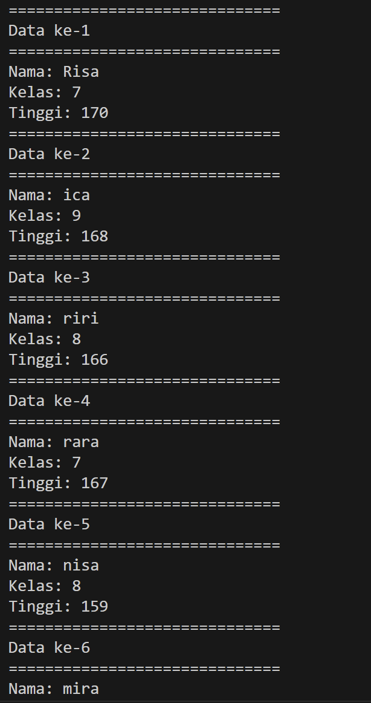
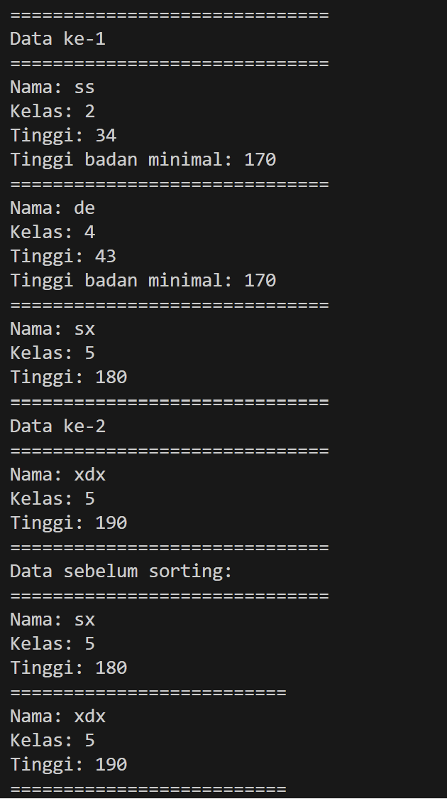
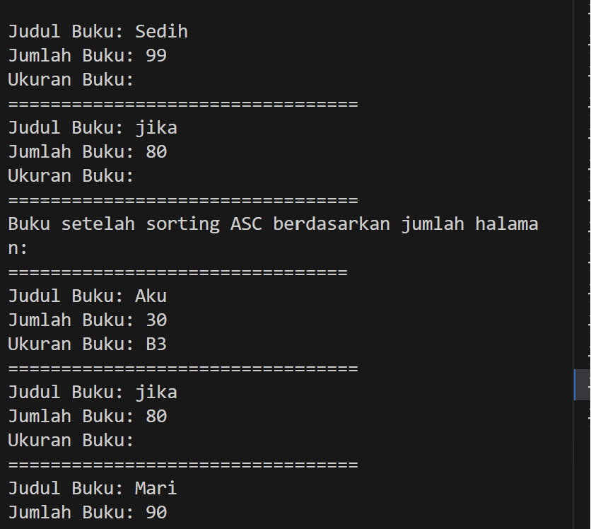

## Laporan Pertemuan 6

NIM : 2241760119

NAMA : MARITZA ULFA HURIYAH

KELAS : SIB 2C

## Praktikum 5.2

Pertanyaan:
1. Kode Sort urut = new Sort(a, a.length); merupakan sebuah instansiasi dari class sort. Dalam instansiasi tersebut diisi oleh konstruktor yang nilai a sudah di inisialisasi.

2. kode temp = data[j];
        data[j]=data[j-1];
        data[j-1]=temp;
berfungsi sebagai penyimpanan data sementara dari data[j] yang ditemukan dimasukkan ke data temp, kemudian data pada data[j] diisi oleh data sebelumnya, kemudian temp dikembalikan di data[j] yang kosong

3. for (int j = i+1; j < jumData; j++) {
            if (data[j]<data[min]) {
                min=j;
            }
        }

4. Outputnya dibawah ini

## Praktikum 5.3

Pertanyaan:
1. Kode 

Bermaksud pada setiap iterasi luar, mencari elemen terkecil dalam sisa array yang belum diurutkan. Kemudian menukar elemen terkecil tersebut dengan elemen yang sedang diurutkan. Langkah ini diulangi hingga seluruh array diurutkan dengan benar. Hasil akhirnya adalah array yang terurut dari yang terkecil ke yang terbesar.

2. Penjelasan:
     - bBbble sort : proses swap akan dilakukan secara berurut dari awal dengan melihat besar atau kecilnya angka setelah suatu indeks, sehingga meski telah mencapai indeks terakhir akan ada kemungkinan proses sorting terus berjalan hingga semuanya telah urut.
     - Selection sort : proses swap akan dilakukan dengan melihat nilai minimum pada indeks setelah leftmost (paling kiri) yang belum terurut sehingga dapat dilakukan dalam satu tahapan Baris tersebut bertujuan untuk melakukan swap pada indeks j dan j-1 apabila nilai indeks j lebih besar daripada nilai indeks j-1

3. Kode tersebut bertujuan untuk mengurutkan objek-objek Mahasiswa berdasarkan nilai ipk mereka dalam urutan menurun (dari yang terbesar ke yang terkecil)

4. Perulangan di dalam bubbleSort():
         for (int i = 0; i < listMhs.length-1; i++) {
            for (int j = 1; j < listMhs.length-i; j++) {
    a. Perulangan i memiliki tanggung jawab untuk mengurangi jumlah elemen yang perlu diurutkan, sementara perulangan j bertugas untuk membandingkan dan menukar elemen yang berdekatan.

    b.  Karena tidak perlu melakukan perulangan hingga indeks terakhir, karena sudah pasti indeks terakhir adalah yang terbesar.

    c. Karena pada setiap iterasi i, elemen terbesar yang telah diurutkan akan dipindahkan ke posisi terakhir, sehingga tidak perlu lagi memeriksa elemen tersebut saat iterasi j.

    d. 49 kali perulangan i, 49 tahap untuk mencari indeks dari nilai minimum

5.  int idxMin=i;
            for (int j = i+1; j < listMhs.length; j++) {
                if (listMhs[j].ipk < listMhs[idxMin].ipk) {
                    idxMin=j;
                }
            }
    Setelah mendeklarasikan variabel idxMin dengan nilai i, kode melakukan perulangan untuk mencari nilai minimum dalam array. Jika nilai IPK dari array listmhs pada indeks j lebih kecil dibandingkan dengan nilai IPK dari array listmhs pada indeks idxMin, maka nilai pada indeks j akan dianggap sebagai nilai minimum.

## Tugas
1. 
2. 
3. 2. 

