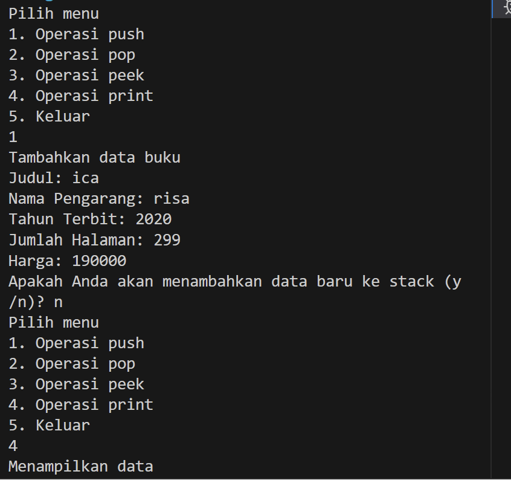
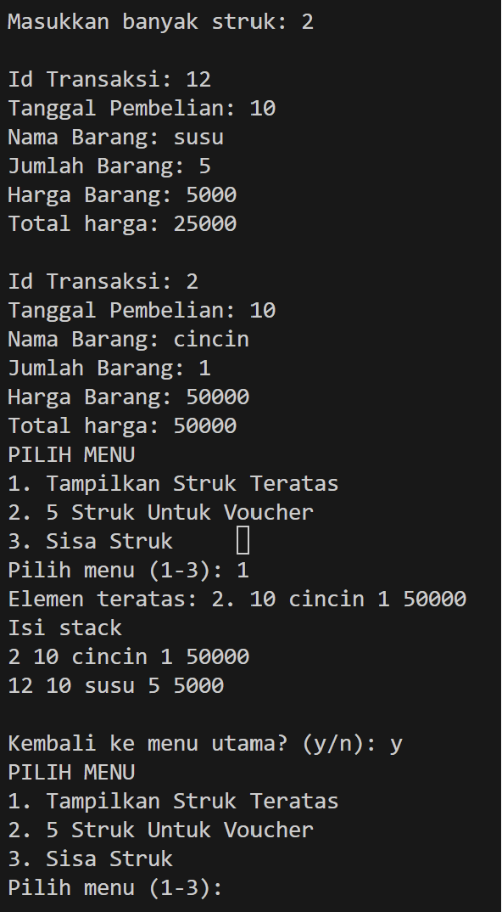

# Laporan Pertemuan 9
NIM : 2241760119

NAMA : MARITZA ULFA HURIYAH

KELAS : SIB 2C

## Percobaan 1
Pertanyaan:
1. Kode tersebut bermaksud banyak data pakaian yang dapat ditampung dalam stack ada 5

2. Outputnya sebagai berikut:

3. Hal itu Karena size stack hanya 5 sedangkan ketika memasukkan angka 40 sudah melebihi size tersebut, dan 40 berada di paling atas akhirnya yang dikeluarkan.

## Percobaan 2
Pertanyaan:

1. data yang tersimpan adalah data yang diinputkan oleh user

2. Stack st = new Stack(8);

3. Do-while sebagai perulangan yaitu user menginputkan jenis, warna, merk, ukuran, harga. Setelah itu user akan diberi pilihan apakah user hendak menambahkan data baru atau tidak. Jika user menginputkan “y” maka perulangan do-while akan dijalankan lagi, jika user menginputkan “n” maka perulangan berhenti dan program memproses kode program
selanjutnya.

4. outputnya sebagai berikut

## Percobaan 3
1. Dengan switch case ketika operator adalah “^” maka akan return nilai 3, jika operator “%” “/” “*” maka akan mereturn nilai 2, jika operator “-“ “+” maka akan mereturn nilai 1

2. Variabel c menyimpan data char ke-i kedalam variabel Q. 

3. Output:
Masukkan ekspresi matematika (infix) : 
3*5^(8-6)%3 
Postfix: 3586-^*3%

4.  Karena dalam proses postfix, ketika ada kurung maka tanda kurung tersebut akan langsung di pop tanpa dimasukkan ke dalam postfix.

## Tugas
1. 

2. 