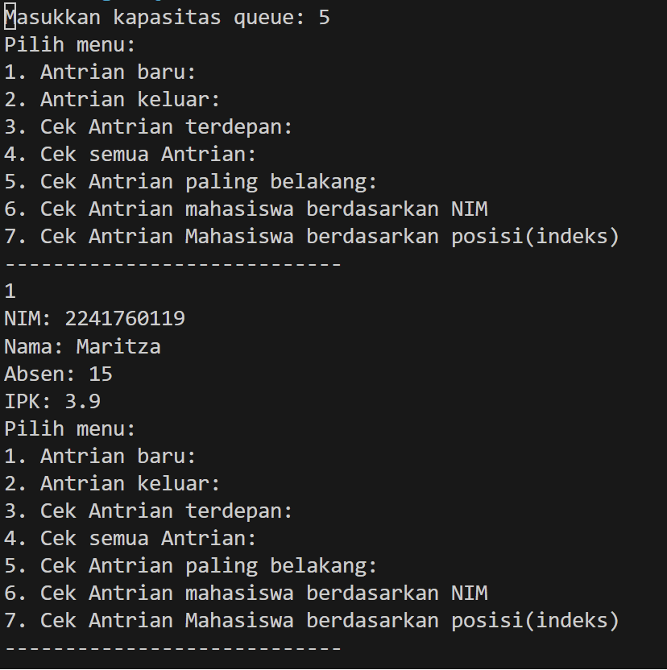

# Laporan Pertemuan 9
NIM : 2241760119

NAMA : MARITZA ULFA HURIYAH

KELAS : SIB 2C

## Percobaan 1

Pertanyaan:
1. Atribut front dan rear bernilai -1 karena size sedang kosong. Sedangkan atribut size bernilai 1 karena indeks array dimulai dari 0.

2. Kode tersebut digunakan jika rear sama dengan max – 1 yang kemudian jika ada penambahan data (rear) baru, data (rear) tersebut ditempatkan pada indeks ke-0.

3. kode ini Q[rear] = data;

4. Kode ini data = Q[front];

5. Memindahkan front ke indeks paling depan apabila sebelumnya front terdapat pada indeks paling terakhir

6. karena front tidak selalu pada indeks ke-0

7. Iterasi i akan terus bertambah sampai indeks terakhir queue, lalu akan mengulang ke indeks-0

## Percobaan 2
Pertanyaan:
1. Untuk menginstansiasi objek baru bernama data yang akan diisi dengan data yang didapat dari dequeue

2. Akan terjadi error, karena method Penumpang mempunyai parameter di dalamnya

3. data = Q[front];

4. Kodenya sebagai berikut:
public void peekRear() {
        if (!IsEmpty()) {
            System.out.println("Elemen terbelakang: " + Q[rear].nama + " " + Q[rear].kotaAsal
                + " " + Q[rear].kotaTujuan + " " + Q[rear].jumlahTiket + " " + Q[rear].harga);
        } else {
            System.out.println("Queue masih kosong");
        }
}

## Tugas
1. 